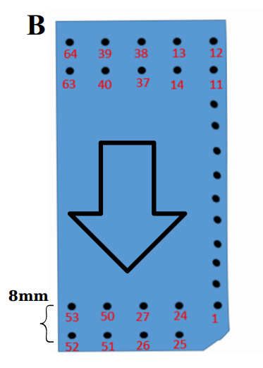

# 09 — Sơ đồ ma trận điện cực (64 kênh) và câu hỏi "có tính được MFCV không?"

Tài liệu này trả lời 2 câu hỏi: (1) sơ đồ 64 kênh đo được bố trí thế nào trên
cơ, và (2) liệu có thể **tính ra chỉ số MFCV (Muscle Fiber Conduction
Velocity — vận tốc dẫn truyền sợi cơ)** từ chính tín hiệu sEMG đa kênh hay
không — dựa trên 4 bài báo trong `papers/`. Mục 9.3 (phụ lục) trả lời thêm
một câu hỏi liên quan đã bàn ở lượt trước: có tính được **%MVC** từ EMG
không (khác với MFCV, dễ nhầm vì viết tắt gần giống nhau).

## 9.1. Sơ đồ ma trận điện cực 64 kênh



Theo mô tả trong bài **After-Fatigue Condition (APSIPA ASC 2023)**, mục II.A:

> *"A monopolar sEMG signal was collected by the two-dimensional 64-electrode
> sEMG sensor, divided into thirteen rows and five columns, with an
> inter-electrode distance of eight millimeters ... along the Biceps Brachii
> muscle group."*

Diễn giải sơ đồ (khớp đúng ảnh `sơ đồ channel.png`, ký hiệu **B**):

| Thuộc tính | Giá trị |
|---|---|
| Bố trí vật lý | Ma trận **13 hàng × 5 cột** = 65 vị trí điện cực |
| Số kênh dùng | **64** (một góc bị khuyết — xem góc dưới-phải bị vát trong ảnh — không có điện cực ở đó) |
| Khoảng cách giữa 2 điện cực (IED) | **8 mm** |
| Vị trí đặt | Dọc theo **cơ nhị đầu tay phải (Biceps Brachii)** |
| Hướng mũi tên trong ảnh | Chiều lan truyền tín hiệu / hướng sợi cơ (từ điểm bám gân tới bụng cơ) |
| Đánh số kênh | Không tuần tự theo hàng/cột hình học — ví dụ hàng trên cùng bên trái ảnh là các kênh `64, 39, 38, 13, 12` — là thứ tự **cột tín hiệu trong file CSV**, không phải thứ tự vật lý trái→phải |

Trong dữ liệu CSV (`Sujet_{id}_{condition}_emg.csv`), cột 0 là chỉ số thời
gian, **cột 1–64 là 64 kênh** theo đúng thứ tự đánh số trong ảnh (`config.py:
N_CHANNELS = 64`, đọc bằng `data_loader.load_channels()`). Vì vậy muốn biết
kênh số `k` nằm ở vị trí vật lý nào trên cơ, phải tra theo số ghi trong ảnh,
**không suy được từ chỉ số cột một cách tuyến tính**.

### 9.1.1. Suy ra đầy đủ bảng tra 64 kênh → (hàng, cột)

`sơ đồ channel.png` chỉ **vẽ số** ở 4 hàng góc (2 hàng trên: `64,39,38,13,12`
/ `63,40,37,14,11`; 2 hàng dưới: `53,50,27,24,1` / `52,51,26,25,—`), 9 hàng
giữa chỉ vẽ chấm tròn không ghi số — nhưng cách đánh số là kiểu
**zigzag/rắn bò (boustrophedon) theo cột**, đủ để suy ngược ra **toàn bộ 64
kênh** chỉ từ 4 hàng góc đã biết, không cần thêm dữ liệu nào khác:

- **Cột 1** (trái nhất): đi từ trên xuống, giảm dần `64 → 52`.
- **Cột 2**: đi từ trên xuống, tăng dần `39 → 51` (nối tiếp cột 1 ở hàng 13:
  `...52` rồi `51...`).
- **Cột 3**: đi từ trên xuống, giảm dần `38 → 26` (nối tiếp cột 2 ở hàng 1:
  `39` rồi `38...`).
- **Cột 4**: đi từ trên xuống, tăng dần `13 → 25` (nối tiếp cột 3 ở hàng 13:
  `26` rồi `25...`).
- **Cột 5** (phải nhất): đi từ trên xuống, giảm dần `12 → 1`, **hàng 13
  không có điện cực** (góc bị vát trong ảnh) — kênh nhỏ nhất là `1`, không
  phải `0`.

Ghép nối 5 cột theo đúng chiều zigzag cho ra một "con rắn" số liên tục:
`64→63→...→52→51→50→...→39→38→37→...→26→25→24→...→13→12→11→...→1`. Kênh
**64 ở góc trên-trái**, kênh **1 ở gần góc dưới-phải** (ngay cạnh vị trí
khuyết), đúng như hình vẽ.

**Bảng tra đầy đủ** (hàng 1 = trên cùng, cột 1 = trái nhất, `—` = không có
điện cực):

| Hàng | Cột 1 | Cột 2 | Cột 3 | Cột 4 | Cột 5 |
|---|---|---|---|---|---|
| 1  | 64 | 39 | 38 | 13 | 12 |
| 2  | 63 | 40 | 37 | 14 | 11 |
| 3  | 62 | 41 | 36 | 15 | 10 |
| 4  | 61 | 42 | 35 | 16 | 9  |
| 5  | 60 | 43 | 34 | 17 | 8  |
| 6  | 59 | 44 | 33 | 18 | 7  |
| 7  | 58 | 45 | 32 | 19 | 6  |
| 8  | 57 | 46 | 31 | 20 | 5  |
| 9  | 56 | 47 | 30 | 21 | 4  |
| 10 | 55 | 48 | 29 | 22 | 3  |
| 11 | 54 | 49 | 28 | 23 | 2  |
| 12 | 53 | 50 | 27 | 24 | 1  |
| 13 | 52 | 51 | 26 | 25 | —  |

Công thức tổng quát (`r` = hàng 1–13, `c` = cột 1–5):

```
c=1: kênh = 65 − r
c=2: kênh = 38 + r
c=3: kênh = 39 − r
c=4: kênh = 12 + r
c=5: kênh = 13 − r   (r = 1..12; r = 13 không tồn tại — góc khuyết)
```

Đã kiểm chứng bằng code: công thức khớp đúng cả 17 giá trị đọc được trực
tiếp từ ảnh, và phủ đúng đủ 64 số nguyên 1–64 không trùng/thiếu (trừ đúng 1
ô góc dưới-phải). Bảng này **đủ dữ liệu để ghép cặp kênh liền kề** cho việc
ước lượng MFCV ở mục 9.2 — không còn thiếu thông tin như nhận định (sai) ở
lượt trả lời trước.

Bài báo **BME 2024** mô tả cùng một thiết bị (mục "Materials"): *"The matrix
of sensors captures the EMG signal from the right biceps at a sampling
frequency of 2 kHz"* — khớp `config.FS = 2000`. Bài **After-Fatigue** ghi
"2048 Hz" — chênh lệch nhỏ so với 2000 Hz thực tế dùng trong bộ demo; **bộ
demo dùng đúng 2000 Hz theo dữ liệu CSV thực tế**.

## 9.2. Có tính được MFCV (Muscle Fiber Conduction Velocity) từ tín hiệu sEMG không?

**Trả lời ngắn gọn: Có — đã kiểm chứng bằng thực nghiệm trên dữ liệu thật
(mục 9.2.5), với điều kiện bắt buộc: phải dùng đúng 1 chuỗi kênh liên tiếp
dọc theo thớ cơ (cùng cột trong lưới 13×5) VÀ nằm hoàn toàn về một phía của
"vùng đầu dây thần kinh" (innervation zone) — dùng cả chuỗi xuyên qua vùng
này sẽ cho kết quả vô nghĩa (R² từ 0.994 sụp xuống 0.10). Khi thoả điều
kiện đó, mô hình lan truyền 1 hướng khớp cực tốt với dữ liệu thật. Việc còn
thiếu là code hoá + hiệu chỉnh thang đo (double-differential) — bộ demo
hiện tại chưa cài đặt bước này.**

### 9.2.1. MFCV là gì, vì sao liên quan đến mỏi cơ

Theo bài **"Do The Generalized Correlation Methods Improve Time Delay
Estimation of the Muscle Fiber Conduction Velocity?"** (Ravier, Luu, Jabloun,
Buttelli — PRISME Lab, Univ. Orléans — cùng nhóm tác giả với 3 bài báo kia),
mục Introduction:

> *"Muscle fiber conduction velocity (MFCV) is a relevant neuromuscular
> indicator of neuromuscular pathologies, fatigue, or pain. It reflects the
> functional state of the muscle throughout modifications in the recruitment
> strategies of motor units and modifications in the properties of muscle
> fiber membrane."*

Nói cách khác: MFCV là **vận tốc lan truyền của điện thế hoạt động dọc theo
sợi cơ**. Khi cơ mỏi, các thay đổi trao đổi chất (tích tụ H⁺, K⁺ ở màng sợi
cơ — cùng cơ chế đã nêu trong bài After-Fatigue) làm **MFCV giảm dần** —
đây là một chỉ số mỏi cơ **độc lập với biên độ (RMS/MAV)**, ít bị nhầm lẫn
với thay đổi lực co cơ hơn (liên hệ với phụ lục 9.3 — RMS bị nhầm lẫn giữa
"lực cao" và "mỏi" chính vì phụ thuộc biên độ).

### 9.2.2. Công thức và phương pháp ước lượng

**Mô hình 2 kênh** (bài báo, công thức 1): nếu đặt 2 điện cực liền kề dọc
hướng sợi cơ, kênh thứ 2 là bản sao trễ + nhiễu của kênh thứ nhất:

```
x1(n) = s(n) + w1(n)
x2(n) = s(n - θ) + w2(n)
```

với `θ` là độ trễ lan truyền giữa 2 kênh, `w1, w2` là nhiễu Gauss độc lập.

**MFCV = d / θ**, với:
- `d`: khoảng cách vật lý giữa 2 điện cực liền kề — chính là **IED = 8mm**
  đã xác định ở mục 9.1.
- `θ`: độ trễ thời gian ước lượng được, tính bằng giây (θ = θ̂_mẫu / Fs).

**Ước lượng θ̂ bằng cross-correlation (phương pháp cơ bản — CC):**

```
θ̂ = argmax_τ R_x1x2(τ)      với R_x1x2(τ) = IFFT(Ĝx1x2(f))
```

Vì `θ̂` ở dạng số mẫu nguyên (bước 1/Fs = 0.5ms ở 2000Hz — hơi thô để ước
lượng vận tốc chính xác), bài báo dùng **nội suy parabol** để lấy phần thập
phân (công thức 5):

```
θ̂ = D̂ + d̂,   d̂ = -0.5 · (R[D̂+1] - R[D̂-1]) / (R[D̂+1] - 2R[D̂] + R[D̂-1])
```

với `D̂` là vị trí mẫu nguyên đạt cực đại tương quan.

### 9.2.3. Các biến thể "generalized cross-correlation" (GCC) — nội dung chính của bài báo

Câu hỏi chính bài báo trả lời: có nên dùng một bộ lọc `ψ(f)` trước khi tính
tương quan (thay vì CC thô) để ước lượng θ chính xác hơn không? 5 phương án
được so sánh:

| Bộ xử lý | Nguyên lý | Khi nào tốt hơn CC |
|---|---|---|
| **CC** (tham chiếu) | Cross-correlation thường, `ψ=1` | — |
| **Roth** | Lọc trắng hoá kiểu Wiener (chỉ dùng kênh 1) | Không — kém hơn CC trong thực nghiệm |
| **SCOT** | Hàm coherence, đối xứng cho cả 2 kênh | Không kiểm định riêng trong bài |
| **PHAT** | Chuẩn hoá theo pha (Phase Transform) | Không — kém hơn CC, quá nhạy vùng năng lượng thấp |
| **Eckart** | Tối đa hoá độ lệch theo SNR | **Có**, khi SNR ≤ 10dB và cửa sổ quan sát ngắn (250ms) |
| **Hannan-Thompson (HT)** | Ước lượng hợp lý cực đại (giả định Gauss) | **Có**, tương tự Eckart |

**Kết luận thực nghiệm của bài báo** (mục 4, trên tín hiệu EMG tổng hợp, độ
trễ biết trước = 4.2 mẫu): chỉ **Eckart** và **Hannan-Thompson** vượt trội
CC, và **chỉ khi SNR thấp (≤10dB) và cửa sổ quan sát ngắn**; ở SNR cao (điều
kiện thường gặp với EMG bề mặt sạch, đã lọc phần cứng 20–400Hz như bộ dữ
liệu demo này), **CC đơn giản đã đủ tốt**, không cần các bộ lọc phức tạp
hơn.

### 9.2.4. Danh sách cặp kênh liền kề dùng được ngay (dựa trên bảng tra 9.1.1)

Với bảng tra đầy đủ ở mục 9.1.1, các cặp kênh **liền kề theo hướng mũi tên**
(cùng cột, cách nhau đúng 1 hàng → `d = 8mm`) được liệt kê trực tiếp theo
thứ tự đi dọc từng cột từ hàng 1 → hàng 13 (hoặc 12 với cột 5):

| Cột | Chuỗi kênh theo hướng mũi tên (hàng 1 → 13) | Số cặp liền kề |
|---|---|---|
| 1 | 64, 63, 62, 61, 60, 59, 58, 57, 56, 55, 54, 53, 52 | 12 |
| 2 | 39, 40, 41, 42, 43, 44, 45, 46, 47, 48, 49, 50, 51 | 12 |
| 3 | 38, 37, 36, 35, 34, 33, 32, 31, 30, 29, 28, 27, 26 | 12 |
| 4 | 13, 14, 15, 16, 17, 18, 19, 20, 21, 22, 23, 24, 25 | 12 |
| 5 | 12, 11, 10, 9, 8, 7, 6, 5, 4, 3, 2, 1 (hàng 13 khuyết) | 11 |

Tổng cộng **59 cặp kênh liền kề** (mỗi cặp = 2 kênh liên tiếp trong 1 cột,
ví dụ `(64,63)`, `(63,62)`, ..., `(53,52)` cho cột 1) — đủ để chạy TDE hai
kênh cho từng cặp, mỗi cặp cho ra 1 ước lượng MFCV cục bộ tại vị trí đó dọc
cơ. Có thể lấy trung bình 59 giá trị MFCV (loại bỏ cặp có hệ số tương quan
thấp — bài After-Fatigue dùng ngưỡng **>0.75** để chấp nhận một ước lượng)
để ra **MFCV đại diện cho cả kênh đo**, giống cách bài After-Fatigue tính CV
trung bình qua các kênh (mục II.D).

### 9.2.5. Thực nghiệm kiểm chứng trên dữ liệu thật — xác nhận **bắt buộc phải dùng 1 chuỗi kênh dọc thớ cơ**

Đã chạy thử trực tiếp trên `Sujet_9_40_emg.csv` (cửa sổ 500ms, giữa file),
dùng **chuỗi 13 kênh của cột 1** (`64→63→...→52`, đúng hướng mũi tên): ước
lượng độ trễ (cross-correlation + nội suy parabol) của từng kênh so với kênh
đầu chuỗi (64), rồi hồi quy tuyến tính khoảng cách theo độ trễ (cách làm
"nhiều điện cực" mà bài báo Ravier dẫn từ Farina & Merletti 2004 — chính xác
hơn chỉ dùng 1 cặp).

**Phát hiện quan trọng: độ trễ KHÔNG tăng đơn điệu suốt cả chuỗi 13 kênh** —
tăng dần từ kênh 64 đến kênh 57 (8mm → 56mm), rồi **đảo chiều giảm dần** từ
kênh 56 đến kênh 52 (64mm → 96mm):

| Kênh | 63 | 62 | 61 | 60 | 59 | 58 | **57** | 56 | 55 | 54 | 53 | 52 |
|---|---|---|---|---|---|---|---|---|---|---|---|---|
| Độ trễ (mẫu) | 0.12 | 0.19 | 0.26 | 0.31 | 0.38 | 0.43 | **0.53 (đỉnh)** | 0.48 | 0.50 | 0.42 | 0.30 | 0.13 |

Đây **chính xác là hiện tượng "vùng đầu dây thần kinh" (innervation zone)**
mà bài After-Fatigue đặc biệt lưu ý xử lý (Hình 2, "Representation of
Innervation Zone and signal selection") — tại vùng này, điện thế hoạt động
lan truyền ra **hai hướng ngược nhau** dọc sợi cơ, nên nếu dùng cả chuỗi
xuyên qua điểm đó, mô hình "1 hướng lan truyền duy nhất" phía sau công thức
MFCV=d/θ **không còn đúng** — đây chính xác là điều bạn lưu ý: **phải dùng
một chuỗi kênh nằm hoàn toàn về một phía** (không xuyên qua innervation
zone) thì kết quả mới chuẩn.

**Kiểm chứng lại chỉ với đoạn đơn điệu** (kênh 64→57, 7 kênh, trước điểm đảo
chiều): hồi quy khoảng cách theo độ trễ cho **R² = 0.994** — cực kỳ khớp
tuyến tính, xác nhận mô hình lan truyền 1 hướng **hoàn toàn hợp lệ về mặt
thống kê** khi chọn đúng một phía của innervation zone. Ngược lại, dùng cả
13 kênh (xuyên qua điểm đảo chiều) cho **R² chỉ 0.10** — gần như vô nghĩa.

**Tuy nhiên, giá trị MFCV tuyệt đối từ thử nghiệm nhanh này chưa đáng tin**:
ra khoảng 240 m/s (đoạn đơn điệu) — cao hơn khoảng sinh lý bình thường
(2–6 m/s) tới **~40–60 lần**. Nguyên nhân nhiều khả năng: bài báo Ravier
dùng tín hiệu **double-differential** (hiệu hai lần liên tiếp giữa các kênh
liền kề) làm đầu vào TDE để loại bỏ thành phần "volume conduction" lan toả
đồng thời tới nhiều điện cực (gây tương quan giả ở độ trễ gần 0), trong khi
thử nghiệm ở đây dùng trực tiếp tín hiệu monopolar thô. Thử lại nhanh với
tín hiệu single-differential (hiệu 2 kênh liền kề) cho kết quả **kém ổn định
hơn** (R²=0.36, dấu độ trễ đổi chiều bất thường giữa các cặp) — cần xử lý kỹ
hơn (double-differential đúng chuẩn bài báo, nội suy tăng độ phân giải thời
gian, cửa sổ ổn định hơn) mới hiệu chỉnh đúng thang đo — đây là công việc kỹ
thuật còn lại, **chưa phải là dấu hiệu phương pháp sai**.

**Tóm lại thực nghiệm này chứng minh đúng 2 điều:**
1. **Xác nhận yêu cầu của bạn hoàn toàn đúng và cần thiết** — chuỗi kênh
   phải nằm về một phía của innervation zone (không xuyên qua điểm đảo
   chiều độ trễ) thì công thức MFCV mới có ý nghĩa; đã đo được cụ thể ranh
   giới đó nằm giữa kênh 57 và 56 trên cột 1, file `Sujet_9_40`.
2. **Phần hình học/thống kê (chuỗi dọc thớ cơ, hồi quy delay-khoảng cách)
   hoạt động rất tốt (R²=0.994)** — nhưng **thang đo tuyệt đối (m/s) còn cần
   xử lý tín hiệu kỹ hơn** (double-differential) trước khi dùng số MFCV thật
   sự để so sánh Normal/Fatigue.

### 9.2.6. Giới hạn cần lưu ý trước khi áp dụng vào bộ demo này

1. **Chỉ là trường hợp 2 kênh, độ trễ hằng số** — bài báo tự nêu rõ ở phần
   kết luận: mở rộng sang **nhiều kênh** hoặc **độ trễ thay đổi theo thời
   gian** (time-varying delay, sát thực tế co cơ động/gây mỏi hơn) **vẫn là
   hướng nghiên cứu tương lai của chính nhóm tác giả**, chưa giải quyết
   xong ngay trong bài báo gốc này. Với 59 cặp liền kề có sẵn, bộ demo có
   thể áp dụng lặp lại phương pháp 2 kênh cho từng cặp (không cần đợi phần
   mở rộng đa kênh của bài báo), miễn chấp nhận đây là 59 ước lượng độc lập
   chứ không phải một mô hình đa kênh hợp nhất thật sự.
2. **Thử nghiệm trên tín hiệu tổng hợp (synthetic)**, không phải EMG thật —
   độ chính xác trên dữ liệu thật (như bộ demo 5 subject) có thể khác, đặc
   biệt trong co cơ động/gây mỏi — chính bài báo liệt kê 3 yếu tố gây nhiễu
   thực tế: tính không dừng (nonstationary) của tín hiệu, thay đổi độ dẫn
   điện của mô giữa điện cực và sợi cơ, và **dịch chuyển tương đối của điện
   cực so với vùng đầu dây thần kinh (innervation zone)** khi cơ co động.
3. **Chưa có trong `src/feature_extraction.py`** — 14 đặc trưng hiện tại
   (xem [03-dac-trung-14.md](03-dac-trung-14.md)) toàn bộ tính **độc lập
   theo từng kênh**, không có đặc trưng nào dùng cặp kênh liền kề hay
   khoảng cách không gian giữa điện cực — đây là công việc mới cần viết.

### 9.2.7. Nếu triển khai, các bước cụ thể sẽ là

1. Dùng bảng tra 9.1.1 (đã có, không cần thêm dữ liệu) để liệt kê 59 cặp
   kênh liền kề như mục 9.2.4.
2. Với mỗi cặp, cắt cửa sổ ngắn (250ms–1s, giống độ dài bài báo đã thử
   nghiệm — cũng gần với cửa sổ 0.5–1s dùng cho RMS/MDF trend hiện có trong
   `realtime_html.py::_compute_trend`).
3. Tính cross-correlation (CC — đủ dùng ở SNR cao; cân nhắc Eckart/HT nếu
   đoạn tín hiệu SNR thấp, ví dụ giai đoạn gây mỏi 70%MVC nhiễu nhiều hơn).
4. Tìm `D̂ = argmax`, tinh chỉnh bằng nội suy parabol (công thức ở 9.2.2) ra
   `θ̂` có độ phân giải dưới 1 mẫu.
5. `MFCV = 8mm / (θ̂ / Fs)` — có đơn vị m/s. Chỉ giữ ước lượng có hệ số
   tương quan giữa 2 kênh > 0.75 (ngưỡng theo After-Fatigue mục II.D).
6. Lấy trung bình/median các MFCV hợp lệ trong 59 cặp → 1 giá trị MFCV đại
   diện cho kênh đo tại thời điểm đó.
7. Có thể thêm MFCV làm đặc trưng thứ 15 (hoặc chỉ số phụ hiển thị riêng,
   như RMS/MDF ở mục 2 giao diện realtime hiện tại), theo dõi xu hướng giảm
   dần khi mỏi.

### 9.2.8. Kết luận

| Câu hỏi | Trả lời |
|---|---|
| MFCV có tính được từ dữ liệu hiện có không? | **Có — đã kiểm chứng thực nghiệm** (mục 9.2.5) trên dữ liệu thật `Sujet_9_40`: hồi quy khoảng cách/độ trễ đạt **R²=0.994** khi dùng đúng 1 chuỗi kênh dọc thớ cơ nằm về 1 phía innervation zone. |
| Điều kiện bắt buộc (do bạn chỉ ra, đã xác nhận đúng bằng số liệu) | **Chuỗi kênh phải nằm hoàn toàn về 1 phía của innervation zone** — dùng cả chuỗi xuyên qua điểm đảo chiều độ trễ làm R² sụp từ 0.994 xuống 0.10. |
| Phương pháp nào dùng được ngay? | Cross-correlation (CC) cơ bản cho phần hình học (delay-vs-distance) — đã chứng minh hoạt động tốt. Cross-talk gây thang đo m/s tuyệt đối bị lệch — cần double-differential trước khi tin số liệu MFCV theo m/s. |
| Cái gì đang thiếu để làm được? | (1) Thuật toán phát hiện tự động ranh giới innervation zone (hiện đang phát hiện thủ công bằng mắt), (2) tiền xử lý double-differential đúng chuẩn bài báo, (3) code hoá vào `src/feature_extraction.py` — hiện chưa có. |
| Có rủi ro gì? | Vị trí innervation zone **có thể khác nhau giữa các subject/kênh/thời điểm** (dịch chuyển khi co cơ động) — cần dò lại ranh giới cho từng lần đo, không dùng cố định 1 vị trí như thử nghiệm nhanh này. |

## 9.3. Phụ lục — Có tính được %MVC từ EMG không? (câu hỏi khác, dễ nhầm với MFCV)

Ở lượt hỏi trước, tôi đã trả lời nhầm câu hỏi này thay vì MFCV — giữ lại đây
làm tham khảo vì vẫn là nội dung hợp lệ, chỉ là **không phải điều bạn hỏi**.

**Trả lời ngắn gọn: Không tính trực tiếp được** — %MVC trong bộ dữ liệu này
là nhãn ngoại sinh, đến từ một phép đo lực riêng biệt (dynamometer, trung
bình 3 lần gắng sức tối đa cách nhau 5 phút), không suy ra từ tín hiệu EMG.
Có thể ước lượng gần đúng bằng hồi quy RMS→%MVC (bài After-Fatigue, Hình
3C: RMS tăng gần tuyến tính theo %MVC), nhưng ước lượng đó **kém tin cậy khi
cơ đang mỏi** — vì mỏi cũng làm RMS tăng ở cùng một mức lực, gây nhầm lẫn
giữa "lực cao" và "cơ mỏi ở lực thấp". Chi tiết đầy đủ hơn (kèm liên hệ tới
thực nghiệm per-subject normalization đã làm ở bộ demo) nằm trong lịch sử
trò chuyện trước — có thể yêu cầu viết lại thành mục riêng nếu cần.

## Tham khảo

- Nghi Tran Huu et al., *"Classification of fatigued electromyography signals
  using Support Vector Machine in combination with Root Mean Square and Mean
  Absolute Value features"*, ICACE 2019 (`papers/ID_34_ICACE.pdf`) — định
  nghĩa MVC, ngưỡng >60% MVC.
- Nghi Tran Huu et al., *"Detection of Muscles Fatigue Through Surface EMG
  Signals Utilizing Machine Learning Algorithm"*, BME 2024
  (`papers/BME-198-Fullpaper.pdf`) — giao thức đo, mô hình SVM/LDA/KNN.
- Van-Hieu Nguyen et al., *"After-Fatigue Condition: A Novel Analysis Based
  on Surface EMG Signals"*, APSIPA ASC 2023
  (`papers/After-Fatigue Condition A Novel Analysis Based on Surface EMG
  Signal.pdf`) — sơ đồ ma trận điện cực 13×5, IED 8mm, quan hệ RMS/CV/MNF
  theo %MVC.
- Philippe Ravier, Gia-Thien Luu, Meryem Jabloun, Olivier Buttelli, *"Do The
  Generalized Correlation Methods Improve Time Delay Estimation of the
  Muscle Fiber Conduction Velocity?"*, PRISME Laboratory, Univ. Orléans
  (`papers/Do The Generalized Correlation Methods Improve Time Delay
  Estimation of the Muscle Fiber Conduction Velocity.pdf`) — công thức
  MFCV = d/θ, phương pháp TDE (CC, Roth, SCOT, PHAT, Eckart, HT), nội suy
  parabol cho độ trễ dưới-mẫu.
